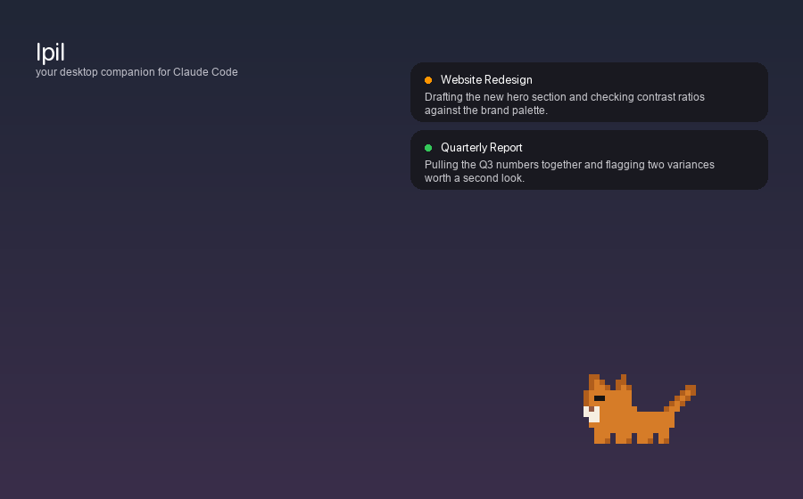

# Ipil 🐈

A native macOS desktop pet that mirrors your [Claude Code](https://claude.com/claude-code) sessions in real time — zero API tokens, zero telemetry, zero dependencies.



## What it does

Ipil lives on your desktop and reflects what Claude is doing:

- **Session pills** float above him — one per active Claude Code session, showing the real chat title, a live status dot (🟠 thinking · 🔵 running a tool · 🟢 writing · 🔴 waiting on you), and a running snippet of the latest reply.
- **Two-way chat** — each pill has a reply button. Ask a quick question or hand it a task; the answer streams back into the pill.
- **Real cat behavior** — Ipil wanders, sits, sleeps, grooms, stretches, and occasionally breaks into zoomies. He's more restless while Claude is actively working and lazier when your desktop is quiet.
- **Lifecycle-aware** — Ipil appears when the Claude desktop app launches and disappears when it quits. An optional "Start Ipil at Login" toggle keeps him always ready.
- **One click to Claude** — click Ipil or any pill to bring the Claude app to the front.

## How it works

Ipil polls the JSONL transcript files Claude Code writes locally to `~/.claude/projects/**/*.jsonl` — the same files the desktop app itself reads. No network calls, no API key, no cost. Replies are sent headlessly via the `claude` CLI (`claude --resume <session-id> -p "..."`).

## Requirements

- macOS 13+
- [Claude Code](https://claude.com/claude-code) installed, with the `claude` CLI on your `PATH`
- Xcode Command Line Tools (for `swiftc`)

## Build & run

```bash
git clone https://github.com/thekhairulakbar/ipil-desktop-pet.git
cd ipil-desktop-pet
./build.sh
open ~/.cache/ipil-build/Ipil.app
```

The build script compiles outside any cloud-synced folder (iCloud/Dropbox/etc. can interfere with code signing mid-build) and ad-hoc signs the app. To install it somewhere permanent:

```bash
mkdir -p ~/Applications
cp -R ~/.cache/ipil-build/Ipil.app ~/Applications/
open ~/Applications/Ipil.app
```

Ipil runs as a menu-bar-only app (no Dock icon). Right-click his menu bar icon or the cat himself for options.

## Notes

- The reply engine grants Claude `--permission-mode acceptEdits` with a Bash allowlist restricted to file-management commands (`mkdir`, `mv`, `cp`, `ls`, `cat`, `find`, `grep`, `touch`, `head`, `tail`, `wc`, `date`, `python3`, `echo`, `cd`) — no `rm`, `sudo`, `git`, or `curl`. A 15-minute timeout kills any stalled reply.
- Replies sent through Ipil are injected into the session's transcript but currently do **not** appear inside the Claude desktop app's own chat view — they're a side-channel, visible only in Ipil's pill. This is a transcript-forking quirk of how the app renders history, not a bug in Ipil.
- Sprite art is pixel-drawn to match a specific character (an orange munchkin cat) — feel free to fork and swap in your own.

## License

MIT — see [LICENSE](LICENSE).
